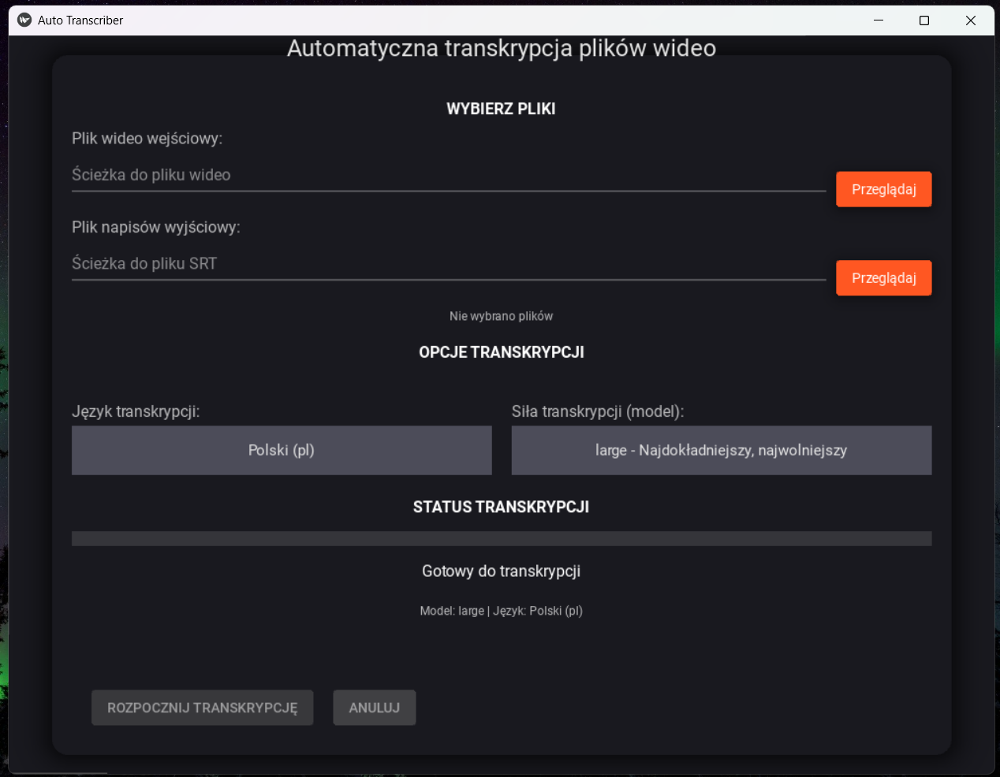

# Auto Transcriber

Program do automatycznego generowania transkrypcji w formacie .srt z plików wideo z eleganckim interfejsem graficznym.



## Wymagania

- Python 3.13 lub nowszy
- FFmpeg (musi być zainstalowany w systemie i dostępny w ścieżce PATH)
- Kivy 2.3.1
- KivyMD 1.2.0

## Instalacja

1. Sklonuj lub pobierz to repozytorium
2. Zainstaluj wymagane biblioteki:

```
pip install -r requirements.txt
```

3. Upewnij się, że masz zainstalowany FFmpeg:
   - Windows: Pobierz z [ffmpeg.org](https://ffmpeg.org/download.html) i dodaj do PATH
   - Linux: `sudo apt-get install ffmpeg`
   - macOS: `brew install ffmpeg`

4. Zainstaluj Kivy i KivyMD:

```
pip install kivy==2.3.1
pip install kivymd==1.2.0
```

## Użycie

Uruchom aplikację za pomocą:

```
python auto_transcriber.py
```

W interfejsie graficznym:

1. Kliknij przycisk "Przeglądaj" obok pola "Plik wideo wejściowy" i wybierz plik wideo do transkrypcji
2. Opcjonalnie kliknij przycisk "Przeglądaj" obok pola "Plik napisów wyjściowy" aby wybrać niestandardową lokalizację pliku SRT
3. Wybierz język transkrypcji z rozwijanej listy
4. Wybierz model Whisper z rozwijanej listy (od tiny do large)
5. Kliknij przycisk "Transkrybuj" aby rozpocząć proces
6. Postęp transkrypcji będzie widoczny na pasku postępu

## Obsługiwane języki

Program wykorzystuje OpenAI Whisper, który obsługuje wiele języków, w tym:

- Polski (pl)
- Angielski (en)
- Niemiecki (de)
- Francuski (fr)
- Hiszpański (es)
- Włoski (it)
- I wiele innych dostępnych w interfejsie

## Modele Whisper

Program pozwala na wybór modelu Whisper bezpośrednio z interfejsu graficznego. Dostępne modele:

- tiny: najszybszy, ale najmniej dokładny
- base: dobry kompromis
- small: dokładniejszy, ale wolniejszy
- medium: bardzo dokładny, ale wymaga więcej zasobów
- large: najdokładniejszy, ale najwolniejszy i wymaga dużo pamięci (domyślny dla języka polskiego)

## Integracja z Adobe Premiere Pro

Wygenerowane pliki .srt można łatwo zaimportować do Adobe Premiere Pro:

1. W Premiere Pro wybierz "File" > "Import"
2. Wybierz wygenerowany plik .srt
3. Przeciągnij plik napisów na ścieżkę wideo
4. Dostosuj styl i wygląd napisów w panelu "Captions"

## Funkcje aplikacji

- Elegancki interfejs graficzny z ciemnym motywem
- Wybór plików za pomocą natywnego eksploratora Windows
- Wybór języka transkrypcji z rozwijanej listy
- Wybór modelu Whisper (siły transkrypcji) z rozwijanej listy
- Asynchroniczny pasek postępu pokazujący stan transkrypcji
- Możliwość anulowania trwającej transkrypcji
- Niestandardowa ścieżka wyjściowa dla pliku SRT

## Uwagi

- Jakość transkrypcji zależy od jakości dźwięku w pliku wideo
- Dla długich plików wideo proces może zająć dużo czasu, szczególnie przy użyciu modeli medium i large
- Whisper działa lokalnie na Twoim komputerze i nie wymaga połączenia z internetem
- Aplikacja została zoptymalizowana pod kątem języka polskiego i domyślnie używa najdokładniejszego modelu (large)
